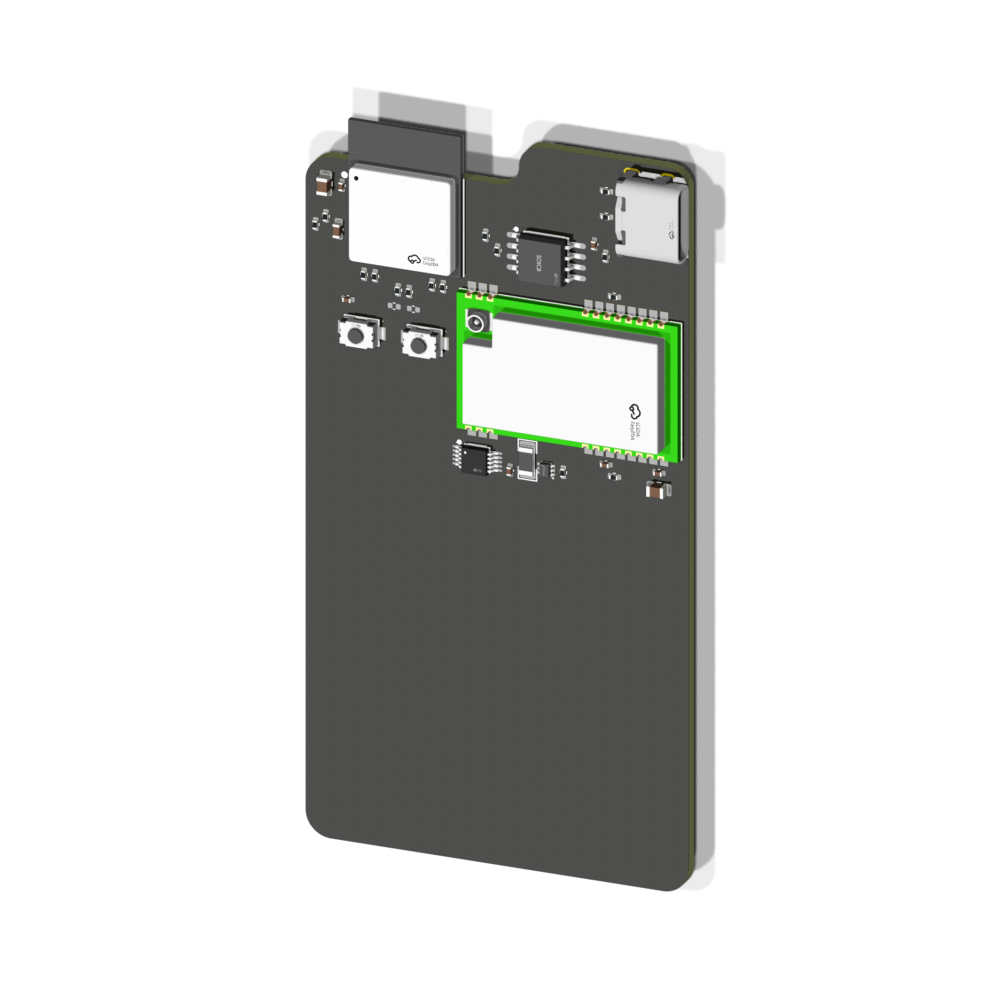
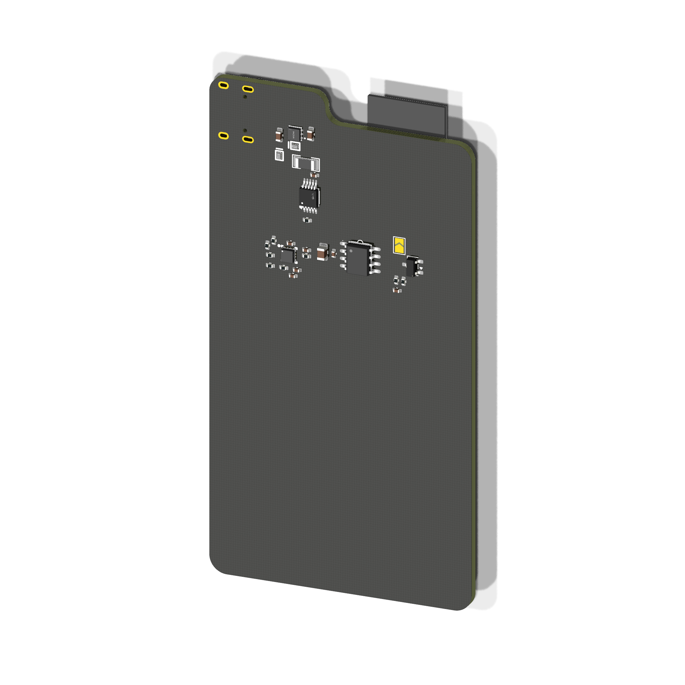

  

<h1 align="center">LIONv3-R</h1>
I

    
    
    
    
    

 

    

## Overview

The LIONv3-R is a powerful IoT and Direct-to-Satellite (DtS) board powered by the ESP32-C6, featuring 16MB of internal memory and versatile local connectivity through Wi-Fi, Zigbee, and Thread. For global communication, it utilizes LoRa (LR-FHSS) technology, which allows for a high density of devices transmitting data reliably directly to satellites from remote locations. By bridging local wireless networks with satellite reach, the LIONv3-R provides a complete and scalable hardware solution for telemetry, global tracking, and remote sensing applications.

## Repository Organization

* `docs`: Systems engineering, datasheets, requirements (SRD), and interface control (ICD).
* `hardware`: Native KiCad project, schematics, and manufacturing files.
* `mechanics`: 3D models, technical drawings, and physical integration constraints.
* `software`: Embedded firmware and support testing scripts.

## Releases

<table>
  <thead>
    <tr>
      <th>Render</th>
      <th>Hardware Revision</th>
      <th>Status</th>
      <th>Latest Release</th>
      <th>Date</th>
      <th>Datasheet</th>
      <th>BOM</th>
      <th>Manufacturing Info</th>
    </tr>
  </thead>
  <tbody>
    <tr>
      <td></td>
      <td>LIONv3-R</td>
      <td>🚧 Development</td>
      <td><a href="#">-</a></td>
      <td>18-08-2026</td>
      <td><a href="#">PDF</a></td>
      <td>-</td>
      <td><a href="#">Gerber</a></td>
    </tr>
  </tbody>
</table>

## Contributing

We welcome contributions to this project! To ensure a smooth collaboration and maintain our engineering standards, please review our [Contribution Guidelines](CONTRIBUTING.md) before opening any issues, modifying the hardware design, or submitting pull requests.

## References

## License

This project utilizes a dual-licensing approach to maximize flexibility and adoption:

* **Hardware:** The hardware designs and schematics are licensed under the permissive **[CERN-OHL-P-2.0](hardware/LICENSE)** open-hardware license. You are entirely free to use, modify, distribute, and commercialize the design without any copyleft obligations to share your derived works under the same terms.
* **Software:** All embedded firmware and utility scripts are licensed under the **[MIT License](software/LICENSE)**. You are free to use, modify, and distribute the code without restriction, provided the original copyright notice and permission notice are included.
